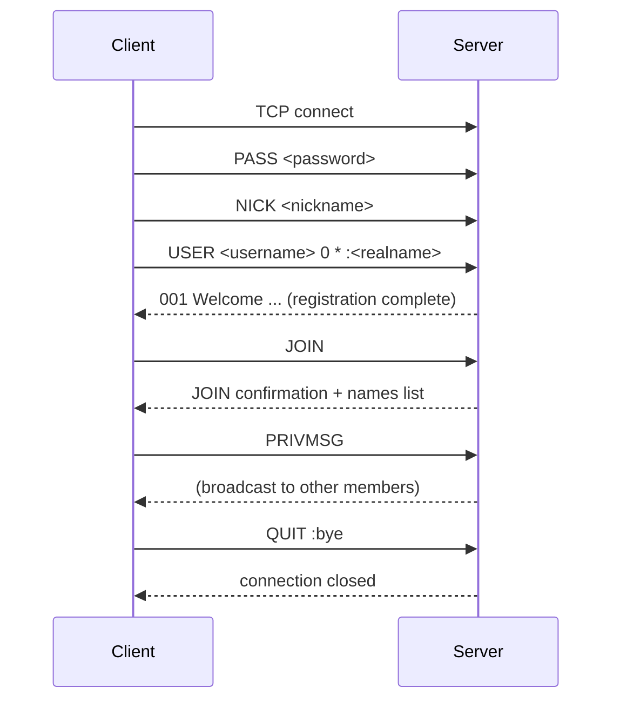
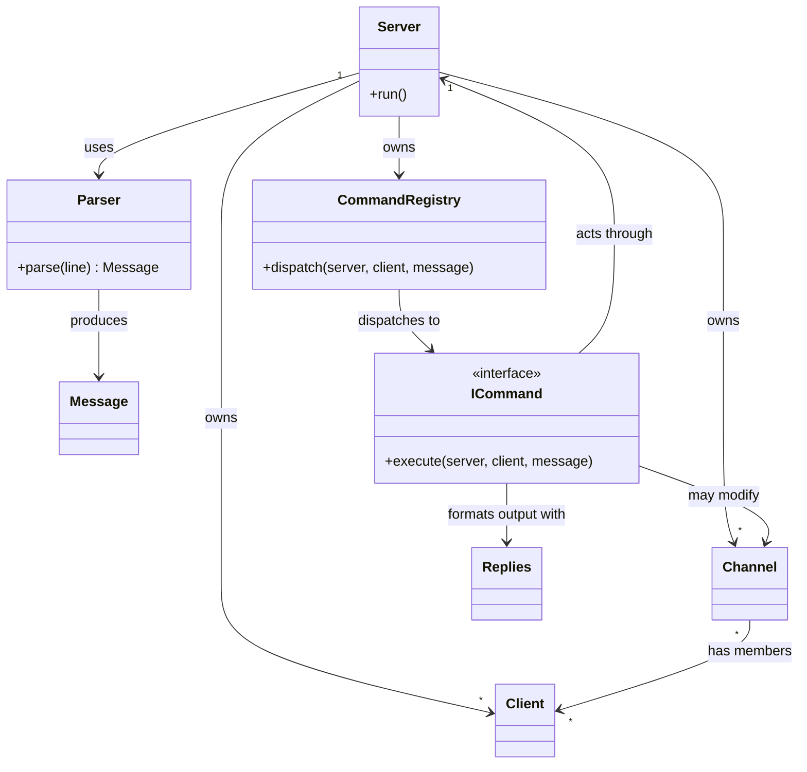

# Architecture & Theory

This document explains *why* the codebase is shaped the way it is: how IRC
itself works, and what job each class is theoretically doing. Read this
before writing any `.hpp` — the goal is that you and your coworkers derive
similar headers independently, then compare.

---

## 1. How IRC actually works

IRC is a plain-text, line-oriented protocol. A client opens a TCP
connection, and from then on the two sides exchange lines terminated by
`\r\n`. Every line is either a **command** (client → server) or a
**reply/message** (server → client), and both have the same basic shape:

```
[:prefix] COMMAND param1 param2 :trailing parameter with spaces
```

- `prefix` — optional, usually server-only on incoming client lines
- `COMMAND` — a word (`JOIN`) or a 3-digit numeric (`001`, `433`...)
- `params` — space-separated, except the last one if it starts with `:`,
  which absorbs the rest of the line (so it can contain spaces)

Numerics matter more than they look: `433` isn't magic, it always means
*nickname in use*. The server doesn't invent prose for errors — it sends a
number plus a conventional message, and the client software decides how to
display it. That's why `Replies` exists as a dedicated formatter: every
error/success in the protocol is a numeric, not a sentence you write.

### Connection lifecycle

A client is *unregistered* until it has supplied a password (if the server
requires one), a nickname, and a username. Only after that does the server
send the welcome numerics and treat the client as a full participant.



This is exactly what `Client::RegistrationState` models: a small state
machine that gates whether commands beyond `PASS`/`NICK`/`USER` are even
allowed to run.

### Why poll() and non-blocking sockets

A single-threaded server can't afford a blocking `recv()` — it would freeze
every other client while waiting on one. `poll()` instead asks the kernel
"which of these file descriptors have data ready?" and only touches the
ones that do. This has a consequence for design: a `recv()` call is not
guaranteed to return one full line, or even a full line at all — it might
return half of one, or three lines at once. That's why `Client` keeps a
persistent `inputBuffer`: incomplete data from one `poll()` cycle has to
survive until the rest arrives on a later cycle.

Useful reading:
- [Beej's Guide to Network Programming](https://beej.us/guide/bgnet/) — the
  standard, very readable intro to sockets
- [`poll(2)` man page](https://man7.org/linux/man-pages/man2/poll.2.html)
- [Modern IRC Client Protocol](https://modern.ircdocs.horse/) — far more
  approachable than the RFC, and what most real servers actually follow
- [RFC 2812](https://www.rfc-editor.org/rfc/rfc2812) — the formal spec, for
  when you need the authoritative answer
- [RFC 1459](https://www.rfc-editor.org/rfc/rfc1459) — the original,
  useful for historical context on why some things are the way they are

---

## 2. The object model

### Message — a fact, not an actor
Holds a parsed line: prefix, command, params. It has no behaviour and no
knowledge of sockets, clients, or channels. It's a *value* — two Messages
built from the same line should be indistinguishable. This separation
matters because it means "did we parse this correctly" is a question you
can answer without a running server at all.

### Parser — translator, deliberately isolated
Pure function: string in, Message out. No side effects, no dependencies on
the rest of the system. This isolation is intentional — it's the one piece
of the protocol's grammar that benefits from being testable completely on
its own, independent of sockets or timing.

### ICommand — abstraction over "a verb happened"
An interface so that "do the right thing for this message" doesn't become
a giant `if/else` chain touched by everyone. Each concrete command (`JOIN`,
`KICK`, `PRIVMSG`...) is a class implementing one `execute()` method. The
design question worth discussing as a group: what does *every* command
need access to, to do its job? That answer becomes your `execute()`
signature — get it right once, because every command depends on it.

### CommandRegistry — a lookup table, not a decision-maker
Maps a verb name to the object that handles it. It doesn't know what any
command *does*. This is what lets three people each add commands without
ever opening the same function.

### Client — identity and mailbox
State that belongs to one connection: nickname, registration progress, and
the raw byte buffers described above. A Client should not know how to
parse a line or how channel membership works — it only holds what is
irreducibly its own.

### Channel — the room and its rules
Membership, operator list, topic, modes. The interesting design decision:
does broadcasting logic live *in* Channel, or in whatever calls it? Putting
it inside Channel means "who receives this message" is decided in exactly
one place — worth doing on purpose rather than by accident.

### Server — orchestrator, not accumulator
Owns the poll loop and the top-level collections (clients, channels). It
should *delegate*, not accumulate logic — if `Server.cpp` keeps growing
past socket plumbing and dispatch, something that belongs to a Channel or
a Command has leaked upward.

### Config — validated input
Parses and validates argv once, at startup, so nothing downstream has to
second-guess whether the port or password is well-formed.

### Replies — pure functions, deliberately stateless
A namespace, not a class with state, because it has nothing to remember
between calls — formatting a numeric reply doesn't depend on anything but
its arguments. Worth discussing: what would it mean for this to have
state, and why is that a smell here?

### How the pieces relate



---

## 3. A question worth answering as a group before coding

For every pair of classes above, ask: **is this arrow necessary, and is it
pointing the right way?** If `Channel` needed to know about `Server`, that
would be backwards — rooms shouldn't need to know about the building. If
`ICommand` implementations start reaching into `Client`'s private buffers
directly instead of through its public interface, that's a sign the
interface is missing something. Disagreements here are cheap to resolve
before code exists and expensive after.
