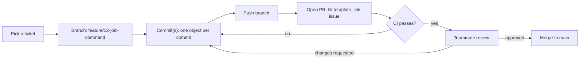

# Git Workflow

---

## 1. One-object-per-commit

**Default:** one commit = one class (its `.hpp` + its `.cpp`
together), or one command file, or one clearly indivisible fix.

```
git add include/Channel.hpp src/Channel.cpp
git commit -m "feat(Channel): add membership and operator tracking"
```

**When you touch several files, ask this question:** *if I reverted this
commit, would the codebase still make sense?* If yes — even with several
files changed — it's one honest commit. If reverting it would leave
something half-finished or referencing a class that no longer exists,
you've bundled two things that should have been two commits.

Concrete guide:

| Situation | Commits |
|---|---|
| New class: header + implementation | 1 commit |
| New class that also requires a one-line registration elsewhere (e.g. adding `KickCommand` means also registering it in the setup function) | 1 commit — the registration is meaningless without the class |
| Fixing a bug in `Parser` *and* a typo in `README.md` | 2 commits — unrelated concerns |
| Implementing `JoinCommand` and `PartCommand` in the same sitting | 2 commits — each is independently revertable and independently reviewable |
| Renaming a method used in 4 files | 1 commit — it's one logical change even though many files changed, because splitting it would leave the code non-compiling between commits |

The underlying principle: **a commit should compile and make sense on its
own.** File count is a side effect of that, not the rule itself.

---

## 2. Commit message format

Use [Conventional Commits](https://www.conventionalcommits.org/):

```
<type>(<scope>): <short summary, imperative mood, no period>
```

- **type** — what kind of change (see table below)
- **scope** — the class or area it touches, e.g. `Channel`, `Parser`,
  `CommandRegistry`, `Makefile`, `ci`
- **summary** — imperative, like a command: "add", not "added" or "adds"

| Type | Use for |
|---|---|
| `feat` | new behaviour (a new class, a new command, a new method) |
| `fix` | correcting a bug in existing behaviour |
| `refactor` | restructuring code with no behaviour change |
| `docs` | README, comments, this file |
| `test` | adding or changing tests |
| `chore` | Makefile, `.gitignore`, project housekeeping |
| `ci` | GitHub Actions workflow changes |
| `style` | formatting only, no logic change |

Examples:

```
feat(Parser): implement IRC line grammar
fix(Server): flush outputBuffer before closing on POLLOUT
refactor(Channel): extract member lookup into helper
docs(architecture): add connection lifecycle diagram
chore(makefile): add re target
```

If a commit closes a ticket, say so in the body (not the subject line),
so GitHub auto-links and auto-closes it:

```
feat(Channel): implement broadcast to member list

Closes #14
```

Use `Refs #14` instead of `Closes #14` when the commit is related but
doesn't finish the ticket on its own.

---

## 3. Branch → commit → PR flow



Day-to-day commands:

```bash
git checkout pre-dev
git pull
git checkout -b feature/14-channel-broadcast

# ...write Channel.hpp and Channel.cpp...
git add include/Channel.hpp src/Channel.cpp
git commit -m "feat(Channel): implement broadcast to member list

Closes #14"

git push -u origin feature/14-channel-broadcast
# then open the PR on GitHub
```

Before pushing, always run `make re` locally — if it doesn't build clean,
CI will fail and block review, which wastes a round trip.

---

## 4. A few habits that prevent most pain

- **Pull `pre-dev` before branching**, every time, so your branch starts from
  the latest merged contract.
- **Small, frequent commits beat one giant commit at the end** — not just
  for review, but because a bad commit is easy to `git revert` when it's
  small.
- **Never commit directly to `main`** — even trivial fixes go through a
  branch and PR, so CI checks every change.
- **If two tickets both need to touch `Server.hpp`**, talk before either
  of you starts — that header is shared contract, not solo territory.
